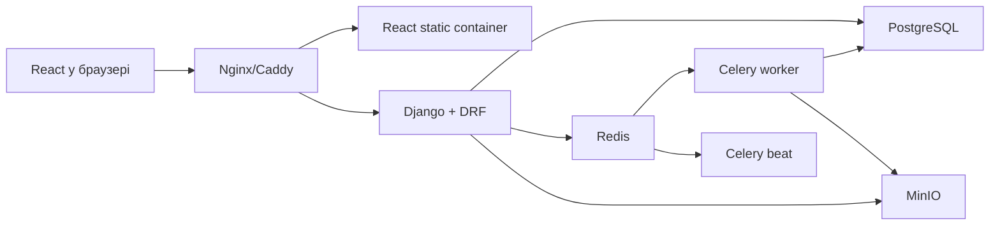
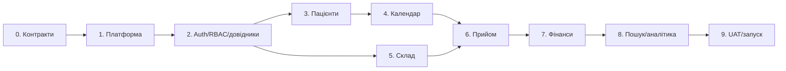

# План агентної розробки Podoria CRM

## 1. Рекомендована технічна основа

Для цієї CRM рекомендований **модульний моноліт на Django**, а не набір мікросервісів.

| Частина | Рішення |
|---|---|
| Backend | Python, Django, Django REST Framework |
| Дані | PostgreSQL як єдине джерело правди |
| Фонові роботи | Celery worker + Celery beat, Redis як broker/cache |
| Frontend | React, TypeScript, Vite, React Router, TanStack Query |
| Форми | React Hook Form + Zod; серверні правила дублюються у DRF serializers/services |
| Фото | приватний MinIO у Docker; S3-сумісний API через `django-storages` |
| Reverse proxy | Nginx або Caddy; один origin для React і `/api` |
| Контракт | OpenAPI від DRF, з нього генерується типізований TypeScript-клієнт |
| Тести | pytest, pytest-django, Vitest, React Testing Library, Playwright |
| Контейнери | Docker Compose для dev/test/stage і тих самих образів у production |

Чому Django тут вигідніший за FastAPI:

- CRM має багато CRUD, ролей, зв’язків, транзакцій і журналів;
- вбудовані auth, sessions, CSRF, ORM, migrations та admin зменшують кількість самописної інфраструктури;
- Django Admin корисний для технічної підтримки, але не замінює користувацький React-інтерфейс;
- DRF дає стабільний REST-контракт для окремого React-фронтенду;
- Celery природно інтегрується з Django.

Redis не є сховищем бізнес-даних. У PostgreSQL залишаються записи, прийоми, платежі, залишки, сповіщення й журнал дій. Celery не проводить оплату, не завершує прийом і не списує склад. Він виконує лише повторювані або довгі задачі після успішного commit:

- створення часових внутрішніх нагадувань;
- формування прев’ю фотографій;
- побудова експортів;
- періодичні службові перевірки;
- очищення тимчасових файлів.

Критичні зміни запускаються синхронно через Django service layer у `transaction.atomic()`. Фонові задачі ставляться через `transaction.on_commit()` і повинні бути ідемпотентними.

## 2. Джерела правди

Порядок пріоритету під час реалізації:

1. `SPECIFICATION.md` — функціональні вимоги й обмеження.
2. Погоджені ADR у `docs/architecture/decisions/` — уточнені рішення для суперечливих місць.
3. `design/index.html` і CSS — візуальна система, компонування та адаптивність.
4. `design/assets/app.js` — лише демонстрація сценаріїв, не готова бізнес-логіка.

Прототип не слід механічно переносити в React. У ньому є демонстраційні спрощення:

- вкладка рекомендацій є заглушкою, хоча специфікація вимагає повний модуль;
- загальні налаштування не містять усіх полів телефону, email та адреси;
- текст дизайну згадує індивідуальні графіки спеціалістів, які виключені з поточного обсягу специфікації;
- каталог статусів у дизайні не повністю збігається з вісьмома статусами специфікації;
- кнопка додавання пацієнта в демо використовує спрощену поведінку форми запису;
- матриця ролей виглядає налаштовуваною, але специфікація задає три фіксовані ролі;
- дизайн показує кілька кімнат/кабінетів, тоді як керування кімнатами окремо не описане.

## 3. Архітектурні правила

### 3.1. Модулі backend

```text
backend/
  config/                 Django settings, URLs, Celery
  apps/
    accounts/             користувачі, ролі, вхід, паролі
    clinic/               профіль, послуги, статуси, робочий час, кімнати
    patients/             пацієнти й медична картка
    scheduling/           записи, календар, доступні вікна
    visits/               чотири кроки прийому, фото, рекомендації
    inventory/            матеріали, партії, рухи, інвентаризації
    billing/              оплати, повернення, касові зміни
    workitems/             внутрішні справи
    notifications/        рольові внутрішні сповіщення
    audit/                незмінний журнал дій
    analytics/            агрегати й звіти
    search/               рольовий глобальний пошук
```

У кожному домені використовуються окремі `models`, `services`, `selectors`, `api`, `tasks` і `tests`. View/serializer не повинні містити складні бізнес-транзакції.

### 3.2. Модель даних та інваріанти

- гроші зберігаються цілим числом у копійках, без `float`;
- кількості матеріалів — `Decimal` з одиницею виміру;
- час зберігається в UTC, відображається в `Europe/Kyiv`;
- одна інсталяція відповідає одній локації без `tenant_id` і без філій;
- медичні фото зберігаються у приватному bucket, доступ видається лише після перевірки ролі;
- записи журналу дій, касові операції та складські рухи не редагуються заднім числом; виправлення створює нову компенсуючу операцію;
- завершення прийому має ідемпотентний ключ або версію, щоб подвійний клік не створив повторні списання чи оплату;
- завершення прийому, історія пацієнта, складські рухи, сума до оплати й audit event створюються в одній транзакції;
- залишок партії блокується через `SELECT ... FOR UPDATE` під час списання;
- перетин записів одного спеціаліста забороняється не лише кодом, а й PostgreSQL exclusion constraint для часового діапазону;
- відкрита касова зміна працівника захищається partial unique constraint;
- повна оплата дорівнює підсумковій сумі прийому; часткової оплати немає.

### 3.3. Авторизація

- web-сесія Django в `HttpOnly`, `Secure`, `SameSite` cookie; CSRF для всіх mutation-запитів;
- Argon2id для паролів;
- перевірка ролей і приналежності даних виконується на API та selector/query рівнях;
- приховування кнопки у React не вважається захистом;
- для кожного endpoint є негативні тести для двох неавторизованих ролей;
- подолог отримує лише власних пацієнтів і записи; ресепшн не отримує медичних полів навіть у JSON.

### 3.4. Docker-топологія



Compose-профілі:

- `dev`: hot reload frontend/backend, PostgreSQL, Redis, MinIO;
- `test`: ізольована БД, backend tests, frontend tests, Playwright;
- `prod`: immutable images, healthchecks, proxy, worker, beat, volumes і backup jobs.

На машині розробника потрібен лише Docker і Docker Compose.

## 4. Організація агентної команди

Рекомендований постійний pod — чотири агенти.

| Агент | Відповідальність |
|---|---|
| A — оркестратор/інтегратор | ADR, декомпозиція, API-контракт, залежності, міграційна черга, інтеграційна гілка |
| B — backend | Django-моделі, service layer, DRF, PostgreSQL constraints, Celery tasks, backend tests |
| C — frontend | React feature modules, перенесення дизайн-системи, API integration, responsive states, frontend tests |
| D — QA/security | acceptance matrix, contract/e2e/concurrency/RBAC tests, accessibility, review міграцій і критичних транзакцій |

Для кожної фічі оркестратор готує task packet:

- посилання на пункти специфікації;
- відповідний екран або стан прототипу;
- дозволені й заборонені ролі;
- OpenAPI request/response/error contract;
- бізнес-інваріанти й транзакційні межі;
- файли/модулі, якими володіє агент;
- acceptance criteria, обов’язкові тести й явно виключений scope.

Робота над фічею йде у такому порядку:

1. Оркестратор фіксує контракт і тестові приклади.
2. Backend і frontend працюють паралельно по одному контракту; frontend спочатку може використовувати MSW fixtures.
3. QA одночасно пише негативні RBAC, API contract та Playwright-сценарії.
4. Інтегратор генерує TypeScript API client, зводить гілки й запускає весь Docker test profile.
5. Фіча переходить у `done` тільки після проходження інтеграційного gate.

Правила уникнення конфліктів:

- лише інтегратор змінює root Compose/CI-конфіг і запускає регенерацію API client;
- номери Django migrations резервуються перед початком паралельної роботи;
- агенти володіють окремими `apps/<domain>` та `src/features/<domain>`;
- один PR має один вертикальний сценарій і займає не більше 1–2 днів роботи;
- агент не виправляє сусідній домен без нового task packet;
- критична транзакція обов’язково проходить окремий review агентом QA/security.

## 5. Поетапний план

Оцінка для pod з чотирьох агентів: **12–14 календарних тижнів** до production-ready MVP. Це орієнтир, а не фіксований дедлайн; він залежить від швидкості погодження правил і UAT.

### Етап 0. Нормалізація вимог і ADR — 3–5 днів

**Мета:** перетворити специфікацію і прототип на однозначний контракт.

- [x] створити [traceability matrix](docs/requirements/traceability-matrix.md) для 23 критеріїв готовності;
- [x] скласти [карту екранів, станів, модалок і доступів](docs/requirements/screen-state-access-map.md) трьох ролей;
- [x] погодити [ERD і життєві цикли](docs/architecture/domain-model.md) appointment, visit, payment, cash shift, stock movement — погоджено 2026-07-20;
- [x] підготувати [реєстр і проєкти ADR-001—ADR-006](docs/architecture/decisions/README.md) щодо кімнат, графіків, повернень, фото, backup і способів оплати;
- [x] погодити ADR-001—ADR-006 — запропоновані defaults прийнято 2026-07-20;
- [x] розбити роботу на [вертикальні task packets](docs/planning/task-packets.md) з контрактами, залежностями, ownership і acceptance evidence;
- [x] позначити прототипні заглушки й невідповідності в [канонічному gap register](docs/requirements/prototype-gap-register.md).

**Gate:** кожен критерій специфікації має фічу, API-контракт, UI-стан і майбутній тест; відкриті рішення мають власника та deadline.

### Етап 1. Docker-платформа і каркас — 1 тиждень

**Backend/infra:**

- монорепозиторій `backend/`, `frontend/`, `infra/`, `docs/`;
- Dockerfiles і Compose profiles для dev/test/prod;
- Django/DRF, PostgreSQL, Redis, Celery worker/beat, MinIO;
- health/readiness endpoints, migrations, seed-команда;
- OpenAPI schema і генерація TypeScript client;
- Ruff, mypy, ESLint, TypeScript strict, pre-commit, CI;
- JSON logs, request/correlation ID, базова error envelope.

**Frontend:**

- React shell, routing, query client, auth boundary;
- дизайн-токени з прототипу: колір, типографіка, spacing, buttons, modal, table, empty/loading/error states;
- desktop/tablet/mobile layout без бізнес-даних.

**Gate:** новий клон запускається однією Docker-командою; lint, migrations, unit smoke та production build проходять у test profile.

**Стан:** TP-101—TP-103 завершено 2026-07-20 — Compose runtime, health/readiness, OpenAPI snapshot, shared error envelope, generated TypeScript client, Docker quality gates, responsive route shell, design tokens, auth-boundary interface, system states і viewport evidence реалізовані. Gate етапу 1 закрито.

### Етап 2. Ідентифікація, RBAC, команда й довідники — 1–1.5 тижня

- вхід/вихід, перший вхід, зміна пароля, запит на відновлення;
- активність/деактивація профілю, захист останнього адміністратора;
- три фіксовані ролі й централізовані access policies;
- команда: створення, редагування, тимчасовий пароль;
- профіль кабінету;
- послуги, ціни, тривалість, колір, активність;
- системні статуси й дозволені переходи;
- робочі години та перерви;
- append-only audit event infrastructure, яку далі використовує кожен домен.

**Gate:** UI і API негативно перевірені для кожної ролі; заборонений прямий URL повертає 403/API error і безпечний UI redirect; ресепшн не бачить admin endpoints.

**Стан:** TP-201—TP-207 завершено 2026-07-21 — email login/logout, server session, CSRF/cookie policy, три фіксовані ролі, role-safe navigation, password lifecycle, append-only audit foundation, team lifecycle, singleton clinic profile, private logo lifecycle, room/service catalogs, вісім захищених системних статусів і єдиний clinic-wide тижневий графік із перервами реалізовані. Optimistic version захищає від lost updates; критичні mutation атомарно пишуть audit. PostgreSQL trigger забороняє зміну/видалення system status codes, а schedule validation відхиляє вихід перерв за день та overlap. Етап довідників закрито; етап пацієнтів розпочато TP-301.

### Етап 3. Пацієнти й внутрішні справи — 1–1.5 тижня

- пошук, список, empty state, пагінація;
- створення/редагування пацієнта, нормалізація телефону, попередження дубліката;
- відповідальний подолог і query scope «мої пацієнти»;
- картка пацієнта, контакти, огляд та вкладки-оболонки;
- окремі API schemas для reception і medical views;
- справи: тип, пацієнт, відповідальний, дата/час, важливість, виконання;
- дія «Перетелефонувати» створює справу, а не дзвінок;
- audit events для patient/workitem mutations.

**Gate:** подолог не може знайти чужого пацієнта ні через список, ні через ID; ресепшн не отримує медичних полів; duplicate-phone path перевірений e2e.

**Стан:** TP-301—TP-303 завершено 2026-07-21 — patient list/live search/create, role-safe patient card/edit і внутрішні справи реалізовані наскрізно. `GET/POST /work-items` та versioned `PATCH /work-items/{id}` застосовують own/all scope до query, не розкривають чужі задачі подологу, перевіряють patient relationship і пишуть same-transaction audit для create/update/complete/reopen. Responsive `/work-items` має live summary, пошук, scope/status filters, create й explicit complete/reopen; дія «Перетелефонувати» відкриває справу з locked patient context і не виконує автоматичного дзвінка. Етап 3 закрито; appointment-linked relationship додано в TP-401, а completed visit/photo/recommendation projections — у TP-605.

### Етап 4. Календар і записи — 1.5–2 тижні

- денний і тижневий календар, desktop/tablet/mobile;
- доступні вікна, перерви, робочі години, спеціалісти й кімнати;
- створення запису з кнопки, вільного вікна, пошуку та картки пацієнта;
- пошук/inline-створення пацієнта;
- locked patient при створенні з його картки;
- послуга, тривалість, скарги/«Скарг немає», коментар;
- редагування, перенесення, скасування і статусний workflow;
- query-level scope подолога;
- PostgreSQL exclusion constraint і concurrency tests для подвійного запису;
- одночасні прийоми різних спеціалістів відображаються без перекриття.

**Gate:** критерії готовності 2–7 і 22 для календаря проходять API та Playwright-тестами, включно з двома одночасними HTTP-запитами на один слот.

**Проміжний реліз M1:** ресепшн уже може вести пацієнтів і календар у реальній БД.

### Етап 5. Складське ядро — 1–1.5 тижня

- матеріали, категорії, одиниці, мінімальні залишки;
- партії, термін придатності, постачальник, закупівельна ціна;
- надходження з кількома позиціями;
- ручне списання з блокуванням залишку;
- FEFO-рекомендація, заборона прострочених партій;
- журнал рухів і фільтри;
- інвентаризація, різниці та компенсуючі коригування;
- low-stock/expiry domain events.

**Статус 2026-07-21:** TP-501—TP-503 завершено, етап 5 закрито — admin-only material/lot catalog, expiry/available/FEFO projections, idempotent multi-line receipts, sorted row locks, no-negative manual write-offs, immutable stocktake snapshots, stale-balance rejection, append-only compensating movements, atomic audit, filtered movement journal і responsive evidence.

**Gate:** неможливий від’ємний залишок навіть при конкурентних списаннях; проведені рухи не редагуються; ресепшн і подолог отримують 403 на склад.

### Етап 6. Оформлення прийому — 1.5–2 тижні

- повноекранний чотирикроковий wizard за дизайном;
- крок 1: скарги, «Скарг немає», огляд, стани, нотатки;
- крок 2: основна/додаткові послуги, кількість, пошук матеріалів і партій;
- крок 3: окреме завантаження фото ДО/ПІСЛЯ, preview, видалення до завершення;
- крок 4: підсумок, рекомендації, наступний запис, передача на оплату;
- autosave/ручна чернетка без складських і фінансових наслідків;
- історія візитів, рекомендації, карусель фото за конкретним відвідуванням;
- атомарний `finish_visit` service: visit + services + photos metadata + stock movements + receivable + history + audit + optional next appointment;
- ідемпотентність, rollback і retry tests.

**Статус 2026-07-22:** TP-601—TP-605 завершено, етап 6 закрито — ARRIVED appointment атомарно та ідемпотентно переходить у IN_PROGRESS з одним visit, assigned-podologist/admin scope і audit; examination/line drafts мають complaint XOR, condition registry, quantities/totals, snapshots та visit-safe FEFO picker без складських, фінансових або completion side effects. Private BEFORE/AFTER lifecycle використовує короткоживучий upload intent, replay-safe finalize, канонізацію JPEG/PNG/WebP без EXIF/GPS, authorized signed read, async preview, cleanup і draft-only audited delete. Atomic finish під узгодженими locks створює stock movements, immutable receivable, recommendation, optional follow-up та audit без часткового commit, а replay не дублює наслідки. Completed patient archive повертає reception-safe або medical own-scope history, visit-grouped private carousel та versioned authored recommendations із conflict recovery. Усі чотири кроки й архів перевірені на desktop/tablet/mobile; TP-701 після цього відкрив етап 7.

**Gate:** критерії 8–12, 18 і 20 проходять; навмисний збій посеред завершення не залишає часткових даних; повторний submit не дублює списання.

### Етап 7. Фінанси й касові зміни — 1.5–2 тижні

- список/пошук/фільтри операцій;
- оплата лише завершеного неоплаченого прийому на повну суму;
- повернення, зв’язане з початковою оплатою;
- внесення і вилучення без пацієнта та способу оплати;
- перевірка доступної готівки;
- відкриття, поточний стан, закриття власної зміни;
- фактична готівка, розбіжність, обов’язковий коментар;
- історія змін і повний касовий список;
- незмінний фінансовий ledger та audit events.

**Статус 2026-07-22:** TP-701—TP-704 завершено. Reception/admin можуть відкрити одну власну зміну з нульовим початковим залишком, отримати ledger-derived own-scope summary та clinic-wide tagged projection, провести idempotent повну оплату, одне повне server-derived повернення з original method і strict cash `DEPOSIT`/`WITHDRAWAL`, а потім звірити та закрити shift з server-derived expected/discrepancy. Exact replay, stale revision, owner/admin scope, close-vs-posting locks, atomic audit, immutable opener/closer/actor snapshots і DB lifecycle/formula/comment guards захищають CLOSED shift від reopen/edit/delete та late ledger rows. `/finance` має operation і close flows, `/finance/shifts` — reception-own/admin-all history, filters/cursor, responsive table/cards і full immutable detail. Canonical gate пройшов 298 backend, 164 frontend і 35 axe tests; focused gate — 71 billing і 14 TP-704 API/migration tests. OpenAPI/types/lint/typecheck/build чисті; dev migration `0004 → 0005 → 0004 → 0005` зберегла 1 OPEN shift, 1 CARD payment і counts `1/0/0/1`, runtime `/`, `/finance`, `/finance/shifts`, `/health/ready` повертає `200`. Authenticated desktop/tablet/mobile browser gate підтвердив close dialog без submit, history/full ledger detail, 0 page overflow, 44 px targets і clean console. [TP-704 evidence](docs/evidence/tp-704/README.md) також фіксує незмінний фінальний OPEN state; live close user-owned shift не виконувався.

**Gate:** критерії 14–17 і finance-частина 20 проходять; AC-16—AC-17 мають стан `verified`. Подвійна оплата, подвійне/конкурентне повернення й double/concurrent close заблоковані constraint/service layer; physical cash, revision і shift status перевіряються під lock, а totals та reconciliation відтворюються з ledger без збережених «магічних» значень.

**Проміжний реліз M2:** повний операційний цикл «запис → прийом → склад → оплата → каса».

### Етап 8. Пошук, сповіщення, аудит і аналітика — 1–1.5 тижня

- глобальний пошук по дозволених категоріях;
- PostgreSQL trigram/normalized indexes; без Elasticsearch для одного кабінету;
- внутрішні сповіщення, unread state, deep links;
- Celery beat для часових нагадувань, усі задачі ідемпотентні;
- повний admin audit UI з «Було → Стало»;
- аналітика: візити, виторг, середній чек, повторні/нові пацієнти, no-show, послуги, завантаження;
- періоди й фільтри оновлюють усі показники;
- асинхронний експорт лише там, де він погоджений.

**Gate:** пошук і сповіщення не витікають між ролями; аналітичні суми звіряються з ledger/visits на контрольному dataset; повторний Celery task не створює дублікатів.

**Стан:** TP-801 і TP-802 завершено 2026-07-22. Role-scoped global search по patients, appointments, payments і materials застосовує scope до match/rank/limit/serialization, використовує exact/prefix/substring ranking, `pg_trgm` та вісім targeted GIN indexes. Recipient-owned internal notifications мають server unread state, idempotent `(recipient, event_key)`, role-safe local deep links, immediate `on_commit()` domain events і щохвилинні Celery beat reminders. Search і notifications пройшли contracts, migrations/data preservation, runtime, security та authenticated desktop/tablet/mobile gates; фінальний TP-802 gate — 340 backend, 180 frontend і 37 axe tests. AC-22 має стан `verified`; [TP-802 evidence](docs/evidence/tp-802/README.md).

TP-803 завершено 2026-07-22: admin-only `/audit` реалізує search/employee/section/date filters, cursor list і reload-stable detail з redacted «Було → Стало», actor/object/result/correlation context та allowlisted object links без edit/delete/export. Registry completeness, append-only/redaction/RBAC/date contracts, responsive focus/body-lock lifecycle і authenticated desktop/tablet/mobile gates пройшли; browser gate додатково виправив обрізання рядків та 42 px mobile close target. Фінальний gate — 342 backend, 187 frontend і 38 axe tests; AC-20 має стан `verified`. [TP-803 evidence](docs/evidence/tp-803/README.md).

TP-804 завершено 2026-07-22: `/` замінив prototype numbers на role-scoped live overview для admin/reception/podologist, а admin-only `/analytics` отримав server-backed period/specialist/service filters, KPI, trend, outcomes, specialist utilization і immutable service ranking. Net revenue віднімає refunds і не включає cash adjustments; control dataset, RBAC/range/OpenAPI contracts, loading/empty/error/retry та migration-free runtime пройшли. Canonical gate — 345 backend, 192 frontend і 39 axe tests; authenticated Edge на 1440×900, 1024×768 і 390×844 підтвердив adaptive layouts, quarter refetch, no overflow/export і clean console. [TP-804 evidence](docs/evidence/tp-804/README.md).

TP-901—TP-903 завершено 2026-07-22. Після cross-feature та security/privacy gates TP-903 додав encrypted off-host PostgreSQL/MinIO recovery points, retention 30 daily/12 monthly, isolated restore verification, production-like immutable deployment та image-only rollback без reverse migrations. Фінальний gate — 357 backend, 198 frontend, 40 axe; ops image має 0C/0H/0M/0L у Docker Scout, restore відтворив 53 migrations і 10 objects без missing/pending/invalid за 8.3s. [TP-901 evidence](docs/evidence/tp-901/README.md), [TP-902 evidence](docs/evidence/tp-902/README.md), [TP-903 evidence](docs/evidence/tp-903/README.md). Наступний пакет — TP-904 full role UAT і 23/23 acceptance release gate.

### Етап 9. Адаптивність, безпека, UAT і запуск — 1–2 тижні

- візуальна звірка з прототипом на desktop/tablet/mobile;
- keyboard navigation, focus management, labels, contrast, touch targets;
- loading, empty, validation, conflict, offline/retry та unsaved-changes states;
- rate limiting входу, session expiry, security headers, file validation;
- перевірка приватності фото та спроб IDOR;
- backup PostgreSQL і MinIO, документований і перевірений restore;
- production healthchecks, rolling restart, міграційний runbook;
- smoke і regression suite за всіма 23 критеріями;
- рольовий UAT із подологом, ресепшном і власником.

**Gate:** 23/23 критерії готовності пройдені, немає critical/high security findings, restore rehearsal успішний, deployment/rollback runbook перевірено.

**Реліз M3:** production-ready MVP.

**Статус 2026-07-23:** TP-904 завершено, реліз M3 закрито з `23/23 verified`.
Full-role UAT перевірив podologist/reception/admin на трьох viewport: 75 route
checks, 11 forbidden redirects, 0 serious/critical axe і clean console. Фінальний
canonical gate — 364 backend, 198 frontend і 40 axe scenarios; fresh/populated
database, npm/pip dependency audits, patched candidate images із 0 critical/high,
production-like deployment та TP-903 encrypted restore/image-only rollback gates
зелені. [TP-904 evidence](docs/evidence/tp-904/README.md).

## 6. Критичний шлях і допустимий паралелізм



Після етапу 2 склад можна розвивати паралельно з пацієнтами й календарем. Прийом інтегрується лише після готовності scheduling та inventory contracts. Фінанси починаються після стабільного `finish_visit`.

## 7. Стратегія тестування

### Backend

- unit tests для status transitions, totals, FEFO, permissions;
- PostgreSQL integration tests замість SQLite;
- API contract tests для success/error schemas;
- property-based tests для перетинів часу, грошових і складських інваріантів;
- concurrency tests для запису, завершення прийому, списання й оплати;
- Celery tasks у eager-mode unit tests та окремі worker integration tests.

### Frontend

- component tests для форм, ролей, wizard і модалок;
- MSW contract fixtures, згенеровані з OpenAPI examples;
- стани loading/empty/error/conflict/unsaved;
- responsive snapshots ключових сторінок.

### E2E

- окремі storage states для admin, reception, podologist;
- 23 критерії специфікації як traceable Playwright suite;
- viewports: desktop, tablet, phone;
- критичний happy path: створити пацієнта → запис → прийом → матеріали/фото → завершити → оплатити → закрити зміну;
- negative paths: чужий пацієнт, зайнятий слот, прострочена партія, недостатній залишок, повторний submit, вилучення понад готівку.

## 8. Definition of Done для кожної фічі

Фіча не готова, поки не виконано все нижче:

- acceptance criteria зі специфікації виконані;
- OpenAPI і TypeScript types синхронні;
- є backend unit/integration та frontend component тести;
- є негативний RBAC test;
- mutation створює коректний audit event;
- міграція проходить на порожній і на заповненій тестовій БД;
- оброблені loading, empty, validation і server error states;
- desktop/tablet/mobile перевірені там, де це користувацький екран;
- критична mutation має concurrency/idempotency test;
- весь Docker test profile зелений;
- немає незадокументованого відхилення від специфікації або ADR.

## 9. Рішення, які слід закрити на етапі 0

1. **Кімнати:** [ADR-001](docs/architecture/decisions/0001-rooms-and-occupancy.md) — одна локація, довідник кімнат і room occupancy constraint.
2. **Графік:** [ADR-002](docs/architecture/decisions/0002-clinic-wide-schedule.md) — лише спільний тижневий графік кабінету.
3. **Повернення:** [ADR-003](docs/architecture/decisions/0003-full-refunds-only.md) — одне повне повернення на payment.
4. **Фото:** [ADR-004](docs/architecture/decisions/0004-private-visit-photos.md) — private storage, формати, ліміти, доступ і retention.
5. **Резервні копії:** [ADR-005](docs/architecture/decisions/0005-backup-and-restore-policy.md) — off-host backup, retention, RPO/RTO і restore drill.
6. **Способи оплати:** [ADR-006](docs/architecture/decisions/0006-payment-methods.md) — `CASH`, `CARD`, `TRANSFER`.

Усі шість ADR мають статус `Accepted` від 2026-07-20. Залежні migrations повинні відповідати прийнятим рішенням; зміна контракту потребує нового ADR.

## 10. Найбільші ризики

| Ризик | Контроль |
|---|---|
| Витік медичних даних між ролями | selector-level scope, окремі schemas, negative RBAC/IDOR tests |
| Подвійний запис при гонці | PostgreSQL exclusion constraint + transaction tests |
| Подвійне завершення прийому | idempotency + row lock + atomic service |
| Від’ємний склад | lot row locks, DB checks, append-only movements |
| Некоректна каса | ledger як джерело totals, unique constraints, compensating operations |
| Ненадійні Celery retries | `on_commit`, idempotency key, retry policy, dead-letter monitoring |
| Публічний доступ до фото | private bucket, authorization before signed URL, short TTL |
| Сліпе копіювання демо-логіки | traceability matrix і пріоритет SPEC → ADR → design |
