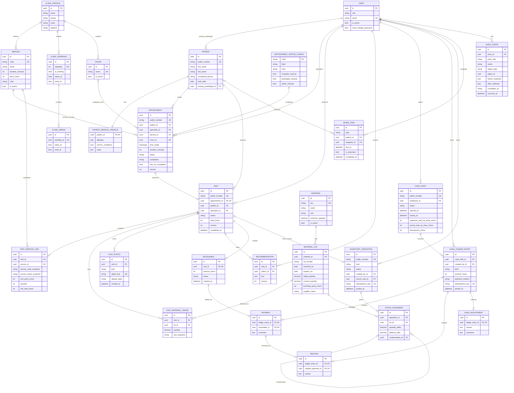
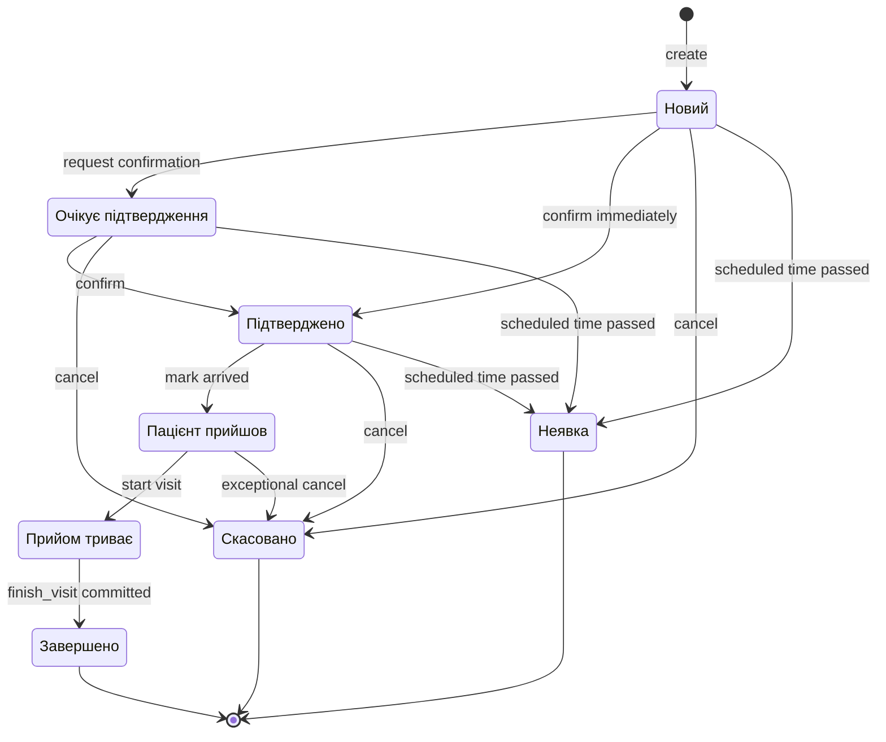
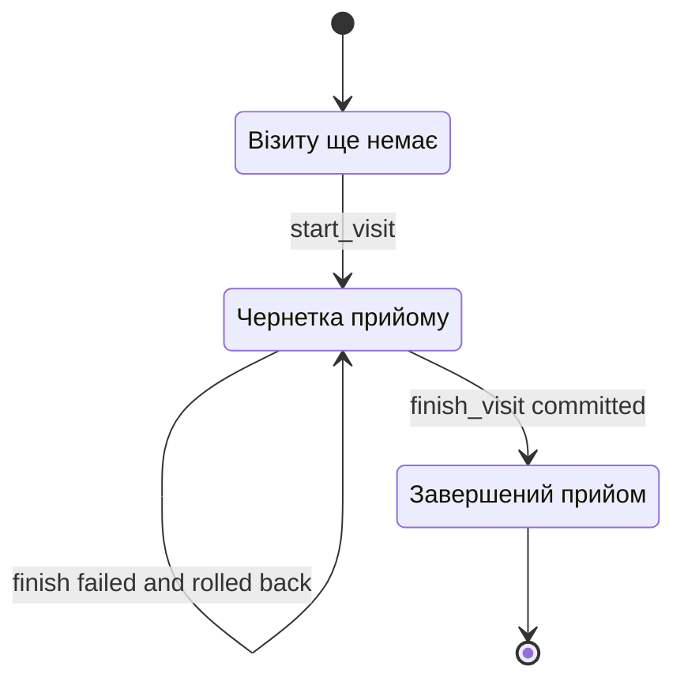
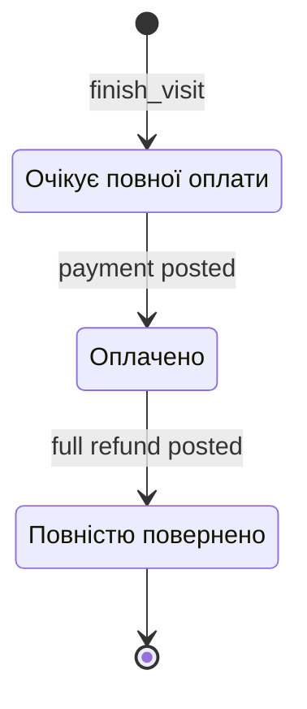
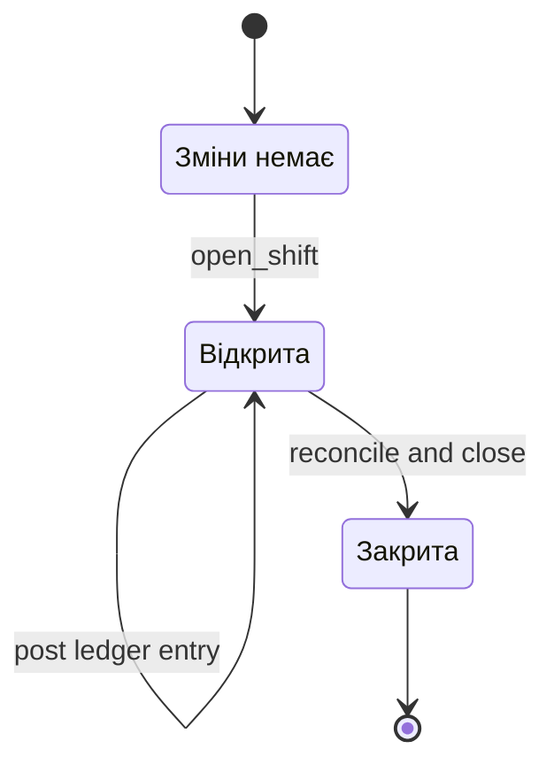
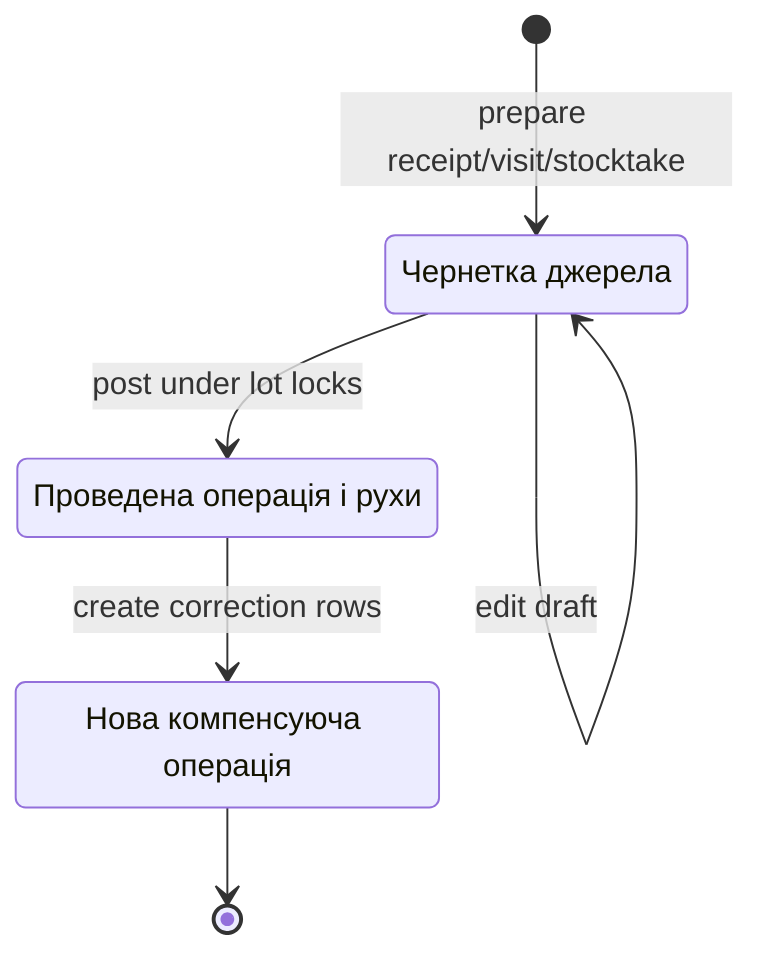

# ERD і життєві цикли Podoria CRM

- Версія: `0.1`
- Статус: `proposed` — підготовлено для погодження
- Джерело вимог: [`SPECIFICATION.md`](../../SPECIFICATION.md)
- Архітектурний план: [`DEVELOPMENT_PLAN.md`](../../DEVELOPMENT_PLAN.md)
- UI/data scopes: [`screen-state-access-map.md`](../requirements/screen-state-access-map.md)
- Acceptance tracing: [`traceability-matrix.md`](../requirements/traceability-matrix.md)

## 1. Межі моделі

Модель описує одну інсталяцію для одного подологічного кабінету. `tenant_id`, філії та міжфілійні зв’язки відсутні.

Базові правила:

- primary keys — UUID; окремі user-visible номери генеруються незалежно;
- час зберігається у UTC, API використовує ISO 8601, UI показує `Europe/Kyiv`;
- гроші — integer minor units (`*_minor`, копійки), без `float`;
- кількості матеріалів — `Decimal` разом з одиницею матеріалу;
- історичні references не видаляються каскадно через деактивацію працівника, послуги або матеріалу;
- фінансові записи, audit events і проведені складські рухи append-only;
- критичні mutation виконуються в Django service layer у `transaction.atomic()`;
- Celery запускається лише через `transaction.on_commit()` і не завершує visit, не проводить payment та не змінює stock balance;
- role/data scope є частиною selector і service contracts, а не властивістю лише React UI.

## 2. Агрегати та власники інваріантів

| Агрегат | Root | Вкладені/пов’язані сутності | Інваріанти, якими володіє root |
|---|---|---|---|
| Accounts | `User` | password reset requests, sessions | fixed role, active state, forced password change, last-admin protection |
| Clinic catalog | `ClinicProfile` / `Service` | workdays, breaks, status config, optional rooms | one clinic, system status codes, valid workday/break ranges, inactive historical services retained |
| Patient | `Patient` | medical profile | normalized searchable contacts, duplicate phone warning, medical data isolation |
| Scheduling | `Appointment` | status history via audit | valid time range, specialist availability, allowed transition, patient/complaint rules |
| Visit | `Visit` | service lines, material usages, photos, recommendations | one visit per appointment, draft side-effect freedom, immutable completion total, idempotent finish |
| Billing | `Receivable` | payment, refund, cash ledger extension rows | full payment only, one payment per receivable, refund linked to original payment |
| Cash shift | `CashShift` | cash ledger entries | one open shift per employee, ledger-derived totals, close reconciliation, no reopen |
| Inventory | `InventoryOperation` | stock movements | posted movements immutable, non-negative lot balance, one unit per material, idempotent posting |
| Workitems | `WorkItem` | — | allowed assignee/patient scope, explicit completion |
| Audit | `AuditEvent` | — | append-only, redacted before/after, same-transaction recording |

## 3. Концептуальна ERD



ERD показує концептуальні cardinalities. У фізичній схемі optional one-to-one relationships захищаються `UniqueConstraint`, а conditional relationships — `CheckConstraint` та service-level validation.

## 4. Ключові сутності й фізичні інваріанти

### 4.1. Accounts і clinic

- `User.role` — enum `ADMIN`, `RECEPTION`, `PODOLOGIST`; довільних ролей або permission matrix у MVP немає.
- Деактивація `User` блокує login, але не змінює historical foreign keys.
- Не можна деактивувати або позбавити ролі останнього активного admin.
- `Service.code` унікальний; `price_minor >= 0`; `duration_minutes > 0`.
- Деактивована послуга не пропонується для нового appointment/visit line, але залишається у history.
- `AppointmentStatusConfig.code` незмінний і seed-иться вісьмома system codes; label/color/manual-role flags можна змінювати.
- `ClinicBreak` має бути всередині workday, `end > start`, без overlap із іншими breaks цього дня.
- `Room` є conditional entity до ADR-001. Якщо rooms лишаються текстовою міткою, таблиця видаляється, а історичний `room_label_snapshot` зберігається в appointment.

### 4.2. Patient

- `Patient.public_number` унікальний і не перевикористовується.
- `normalized_phone` індексується, але не є unique: специфікація вимагає попередження про можливий дублікат, а не жорстку заборону.
- `primary_podologist_id` optional і не є єдиною підставою доступу; podologist scope також включає пацієнтів із past/future appointments до цього podologist.
- `PatientMedicalProfile` читають лише admin і дозволений podologist; reception serializer не містить цих keys.

### 4.3. Appointment

- `time_range` — PostgreSQL `tstzrange` з межами `[start, end)`; порожній або зворотний range заборонений.
- `duration_minutes` є snapshot, щоб зміна тривалості service не змінювала старий appointment.
- `status` — immutable system code з розділу 6.9 специфікації; UI label/color беруться з config.
- `complaints`/`has_no_complaints` виконують XOR-правило: або непорожній текст, або явна ознака відсутності.
- Перетин appointment одного specialist блокує PostgreSQL exclusion constraint, а не лише availability endpoint.
- Рекомендований constraint:

```sql
EXCLUDE USING gist (
  specialist_id WITH =,
  time_range WITH &&
)
WHERE (status <> 'canceled');
```

- Для constraint потрібне розширення `btree_gist`.
- `no_show` і `completed` лишаються блокуючими для історичного time range; лише `canceled` звільняє slot.
- Якщо ADR-001 підтвердить room occupancy, додається другий exclusion constraint для `room_id`/`time_range` з тим самим predicate.
- Після переходу в `in_progress` patient, specialist, room, primary service і time range не редагуються; корекція потребує admin service та audit.
- `version` використовується для optimistic concurrency під час edit/reschedule/status transition.

### 4.4. Visit

- `appointment_id` unique: один appointment створює не більше одного visit.
- `patient_id` і `specialist_id` є immutable references, скопійованими з appointment під час start.
- Draft може змінювати examination, service lines, material usages, photos metadata і recommendations, але не stock/receivable.
- `VisitServiceLine` зберігає code/name/price snapshots; `quantity > 0`; `line_total_minor = unit_price_minor * quantity`.
- Одна service не дублюється в одному visit: unique `(visit_id, service_id)`, повторне додавання збільшує quantity.
- `VisitMaterialUsage.quantity > 0`; unit збігається з material unit; lot не прострочений на момент finish.
- `VisitPhoto.kind` — `BEFORE` або `AFTER`; object належить конкретному visit і private bucket.
- `Visit.total_minor` встановлюється тільки під час finish як сума service lines і після completion не змінюється.
- Completed visit не reopen-иться. Виправлення медичного тексту після completion оформлюється versioned amendment/recommendation edit з audit, а не повторним finish.

### 4.5. Billing і cash ledger

- `Receivable` створюється лише для completed visit і має ту саму повну суму.
- `Receivable.status`: `OPEN`, `PAID`, `REFUNDED`; сума не редагується після створення.
- UI-ознака «Оплачено» походить із `Receivable`, а не додається дев’ятим appointment status.
- `Payment.receivable_id` unique блокує подвійну оплату на DB-рівні.
- Payment amount не надходить як довільне поле UI: service копіює `Receivable.amount_minor`.
- `CashLedgerEntry.amount_minor > 0`; напрямок визначає `kind`, а не знак у полі.
- `kind`: `PAYMENT`, `REFUND`, `DEPOSIT`, `WITHDRAWAL`.
- `PAYMENT` потребує payment method; `REFUND` наслідує method початкової payment; `DEPOSIT/WITHDRAWAL` не мають patient і payment method.
- `Payment`, `Refund`, `CashAdjustment` — typed one-to-one extensions ledger entry; ledger entry не редагується/не видаляється.
- Safe default для ADR-003: один full `Refund` на один `Payment`, amount дорівнює initial payment. Частковий refund потребує іншої cardinality й суми refund ledger.
- Withdraw і cash refund не можуть перевищити доступну фізичну готівку поточної shift.
- `idempotency_key` unique у межах operation type/actor або глобально, залежно від фінального API contract.

### 4.6. CashShift

- Відкриту shift захищає partial unique constraint:

```sql
CREATE UNIQUE INDEX uq_open_cash_shift_per_employee
ON billing_cash_shift (employee_id)
WHERE status = 'open';
```

- Cash operation завжди посилається на open shift працівника, який проводить операцію; admin support action також має явного actor.
- Expected cash обчислюється з ledger: cash payments − cash refunds + deposits − withdrawals.
- Revenue/card/cash/transfer totals також обчислюються з ledger; `expected_cash_at_close_minor` зберігається як immutable close snapshot, але звіряється з ledger у тестах.
- `discrepancy_minor = actual_cash_at_close_minor - expected_cash_at_close_minor`.
- Якщо discrepancy не нульова, close comment обов’язковий.
- Closed shift не reopen-иться й не приймає нових ledger entries.

### 4.7. Inventory

- `Material.unit` незмінна після першого руху; зміна одиниці потребує нового material.
- `MaterialLot` unique щонайменше за `(material_id, lot_number)`; supplier може уточнити constraint після inventory task packet.
- `current_quantity >= 0`; row блокується `SELECT ... FOR UPDATE` під час будь-якого списання/коригування.
- `StockMovement.quantity_delta != 0`; receipt/return/surplus мають positive delta, write-off/usage/shortage — negative.
- `balance_after` є immutable snapshot після застосування delta.
- `InventoryOperation.kind`: `RECEIPT`, `VISIT_USAGE`, `MANUAL_WRITEOFF`, `STOCKTAKE_ADJUSTMENT`, `RETURN`, `CORRECTION`.
- Operation `POSTED` має щонайменше один movement і не редагується.
- Draft stocktake/receipt document може існувати окремо, але movements виникають лише під час posting.
- Виправлення створює нову `CORRECTION` operation і movement із `compensates_id`; original movement лишається незмінним.
- Stored lot balance має дорівнювати сумі movements; reconciliation test перевіряє це на контрольному dataset.

### 4.8. AuditEvent

- Event створюється в тій самій transaction, що й domain mutation.
- Зберігає actor, role snapshot, action, object reference, redacted before/after, result, request/correlation ID і UTC timestamp.
- Паролі, password hashes, session IDs, signed photo URLs та інші secrets не потрапляють у before/after.
- Таблиця append-only; application DB role не має звичайного update/delete path.

## 5. Життєвий цикл Appointment

System codes:

| Code | UI label |
|---|---|
| `new` | Новий |
| `awaiting_confirmation` | Очікує підтвердження |
| `confirmed` | Підтверджено |
| `arrived` | Пацієнт прийшов |
| `in_progress` | Прийом триває |
| `completed` | Завершено |
| `canceled` | Скасовано |
| `no_show` | Неявка |



Transition rules:

| Transition | Allowed actor | Guards | Atomic side effects |
|---|---|---|---|
| create → `new`/`awaiting_confirmation`/`confirmed` | admin, reception, podologist-to-self | working day, no break/overlap, patient/service active, role scope | appointment + audit |
| active → rescheduled | admin, reception; podologist-to-self if policy permits | status before `in_progress`, availability, expected version | new time range/version + audit |
| `confirmed` → `arrived` | admin/reception; configured role policy | current appointment, not terminal | status/version + notification + audit |
| `arrived` → `in_progress` | assigned podologist/admin | no existing other visit; object scope | visit draft create + appointment status + audit |
| `in_progress` → `completed` | assigned podologist/admin support | valid draft, idempotency, stock, optional follow-up slot | full `finish_visit` transaction |
| eligible → `canceled` | role policy | not completed/no-show; reason required by task packet | status/version + slot released + audit/notification |
| eligible → `no_show` | admin/reception or assigned podologist by policy | scheduled start passed; not arrived/in-progress | status/version + audit |

Terminal states cannot transition back. Admin correction does not rewrite history; it creates an explicit correction action and audit event.

## 6. Життєвий цикл Visit

DB states: `DRAFT`, `COMPLETED`. «Прийом триває» є appointment state; visit draft містить поточну роботу wizard.



`save_visit_draft`:

- locks visit for update or checks expected `version`;
- updates draft children;
- may queue safe photo preview work through `on_commit()`;
- never changes lot balance, never creates receivable/payment і never completes appointment.

`finish_visit`:

1. finds the previous result by idempotency key; if present, returns it;
2. locks appointment and visit;
3. validates actor scope, `in_progress` state, draft completeness, service totals and photo readiness policy;
4. locks selected material lots in stable UUID order;
5. validates expiry and quantity again under lock;
6. validates optional next appointment against working hours and exclusion constraints;
7. snapshots service lines and sets immutable visit total;
8. posts one inventory operation with stock movements;
9. creates one receivable for the full total;
10. optionally creates the next appointment;
11. sets visit and appointment to `completed`;
12. creates audit events and stores idempotency result;
13. only after commit queues notifications/photo post-processing.

Будь-який failure до commit залишає visit у `DRAFT` і не залишає partial stock, receivable або follow-up appointment.

## 7. Життєвий цикл Payment / Receivable

Application transient «posting» не зберігається як DB state. Якщо transaction падає, obligation лишається у попередньому стані.



| Transition | Guards | Writes in one transaction |
|---|---|---|
| `OPEN` → `PAID` | completed visit, open actor shift, no existing payment, method allowed, idempotency key | payment ledger entry + Payment + receivable status + audit |
| `PAID` → `REFUNDED` | original payment exists, no previous full refund, open actor shift, reason, sufficient cash for cash refund | negative-effect refund ledger entry + Refund link + receivable status + audit |

Payment amount always equals receivable amount. Partial payment state, split tender and installment balance do not exist in MVP.

## 8. Життєвий цикл CashShift



`open_shift` створює shift для current employee після partial-unique check. Opening balance у MVP дорівнює нулю, оскільки інша вимога не задана.

`close_shift`:

- locks shift; усі finance posting services також lock shift перед insert ledger entry;
- повторно перевіряє `OPEN` і actor ownership/admin override;
- рахує totals та expected cash із ledger у transaction;
- потребує `cash_count_confirmed=true`;
- зберігає actual, expected snapshot, discrepancy і comment;
- при non-zero discrepancy comment обов’язковий;
- створює audit і переводить shift у `CLOSED`;
- unpaid visits показуються warning, але не входять у ledger і не блокують close.

Closed shift не reopen-иться. Помилка касира виправляється новою операцією в актуальній open shift із посиланням на причину, а не редагуванням старого ledger.

## 9. Життєвий цикл StockMovement

`StockMovement` не має edit lifecycle: row виникає вже `POSTED` у transaction. Draft належить inventory/visit document, не руху.



Стрілка `POSTED → COMPENSATION` означає створення нового `InventoryOperation`/`StockMovement`; original row залишається `POSTED` і незмінним.

Posting algorithm:

1. check idempotency result;
2. validate source document and admin/visit permission;
3. sort lot IDs and lock all lots `FOR UPDATE`;
4. reject expired lot for visit usage;
5. calculate every delta and reject any resulting negative balance;
6. create `POSTED` operation and movements with `balance_after`;
7. update lot cached balances;
8. create audit in the same transaction;
9. emit low-stock/expiry notifications only through `on_commit()`.

## 10. Транзакційні межі

| Service | Locks / concurrency | Writes before commit | `on_commit()` only |
|---|---|---|---|
| `create_or_reschedule_appointment` | expected version + PostgreSQL exclusion | appointment, audit | role-safe notification |
| `start_visit` | appointment | appointment status, visit draft, audit | notification |
| `save_visit_draft` | visit/version | draft fields/lines/photo metadata, audit where required | photo preview task |
| `finish_visit` | appointment → visit → lots sorted | completed visit, stock operation/movements, receivable, optional appointment, audit, idempotency result | notifications, photo post-processing |
| `post_payment` | receivable → cash shift | ledger, payment, receivable state, audit | notification |
| `post_refund` | receivable → payment → cash shift | ledger, refund, receivable state, audit | notification |
| `post_cash_adjustment` | cash shift | ledger, adjustment, audit | optional admin notification |
| `close_cash_shift` | cash shift | close snapshot/state, audit | discrepancy notification |
| `post_inventory_operation` | lots sorted | operation, movements, cached balances, audit | low-stock/expiry notification |

Locking rules:

- service-specific aggregate root lock береться до resource rows;
- кілька `MaterialLot` завжди lock-яться за stable UUID order;
- finance entry service lock-ить `CashShift` до ledger insert, тому close блокує late operation;
- external network/storage call не виконується всередині DB transaction;
- `409` повертається для stale version, slot conflict, already-closed shift, already-paid obligation або insufficient stock;
- database constraint error перетворюється на стабільний domain error code, а не raw SQL message.

## 11. Ідемпотентність

| Mutation | Deduplication key / DB safety | Повторна відповідь |
|---|---|---|
| Create appointment | request key optional; exclusion constraint always | existing appointment representation if same key |
| Finish visit | `(visit_id, idempotency_key)` unique + completed visit guard | original completion result: visit, movements, receivable, follow-up IDs |
| Payment | idempotency key + unique `receivable_id` | original payment/ledger entry |
| Full refund | idempotency key + unique `original_payment_id` | original refund/ledger entry |
| Cash adjustment | idempotency key | original ledger entry |
| Inventory posting | idempotency key + source document posted guard | original operation/movement IDs |
| Close shift | shift state + request key/version | original close snapshot |

Однаковий idempotency key з іншим payload повертає `409 idempotency_payload_mismatch`.

## 12. Видалення, деактивація і виправлення

| Об’єкт | Дозволена дія |
|---|---|
| Appointment | cancel state; hard delete заборонено після створення |
| Visit draft | може бути abandoned лише окремим admin workflow, не непомітно видалений |
| Completed visit | immutable completion facts; versioned medical amendment + audit |
| Payment/refund/cash adjustment | append-only; correction новим compensating ledger entry за погодженим workflow |
| Cash shift | close only; no reopen/delete |
| Stock movement | append-only; correction new movement with `compensates_id` |
| User/service/material | deactivate; historical foreign keys retained |
| Visit photo | draft photo deletable; completed-photo retention/deletion governed by ADR-004 |
| Audit event | no update/delete through application role |

## 13. ADR-залежності й запропоновані defaults

| ADR | Вплив на модель | Запропонований default до рішення |
|---|---|---|
| ADR-001 Rooms | `Room` table, appointment FK, optional room exclusion | One location, multiple active rooms, room occupancy constraint |
| ADR-002 Schedule | Чи має workday FK на specialist | Only clinic-wide workdays/breaks, без individual schedules |
| ADR-003 Refund | `Payment`→`Refund` cardinality, amount rules | One full refund per payment |
| ADR-004 Photos | upload state, metadata, deletion/retention | Private JPEG/PNG/WebP ≤10 MB; draft delete; completed retention policy окремо |
| ADR-005 Backup | Не змінює business ERD; впливає на operational runbook | Daily PostgreSQL + MinIO backup outside production host |
| ADR-006 Payment methods | enum/check constraint and analytics grouping | `CASH`, `CARD`, `TRANSFER` |

Модель навмисно не маскує ці рішення. До прийняття ADR migration, що залежить від конкретного choice, не створюється.

## 14. Перевірки моделі до реалізації

Перед затвердженням migrations потрібні executable examples для таких випадків:

1. два concurrent appointment POST на один specialist/time — рівно один успішний;
2. однаковий час різних specialists — обидва успішні;
3. finish visit із fault після першого lot update — жодних partial rows/balance changes;
4. подвійний finish з одним або різними request retries — один комплект movements/receivable;
5. concurrent write-off одного lot — balance не стає negative;
6. concurrent payment одного receivable — одна payment;
7. payment racing with shift close — або payment входить у close totals, або отримує closed-shift conflict;
8. repeated Celery notification task — без duplicate notification;
9. reception patient query — medical columns/keys відсутні;
10. podologist patient/appointment query — чужі object IDs не знаходяться;
11. ledger-derived shift totals дорівнюють close snapshot;
12. сума stock movements дорівнює cached lot balance.

## 15. Критерій погодження документа

ERD і lifecycle вважаються погодженими, коли:

- підтверджено aggregate boundaries та сутності;
- підтверджено 8 appointment system codes і transition graph;
- підтверджено visit lifecycle `DRAFT → COMPLETED` без reopen;
- підтверджено obligation lifecycle `OPEN → PAID → REFUNDED` без partial payment;
- підтверджено cash shift `OPEN → CLOSED` без reopen;
- підтверджено append-only stock movement/correction model;
- ADR-001—ADR-006 мають owners або прийняті defaults;
- немає невідповідності `SPECIFICATION.md`, traceability matrix і UI role map.
