# TP-1014—TP-1021 — план AI-розробки допрацювань CRM

- Статус: `done`
- Дата фіксації: `2026-08-06`
- Дата завершення: `2026-08-06`
- Джерело: погоджені власником продукту вимоги та уточнення в робочій сесії.

## Фактичний результат

TP-1014—TP-1021 реалізовані як один узгоджений release scope:

- наступний запис із завершення прийому підтримує впорядкований вибір кількох
  активних послуг і сумарну тривалість;
- двосторінкова A4 PDF-квитанція містить порожнє поле для рукописної
  рекомендованої дати;
- каса стала спільною для клініки: дозволена одна відкрита зміна, а наступна
  зміна успадковує фактичний залишок попередньої;
- внутрішні сповіщення дублюються у Telegram лише exact recipient через
  durable delivery із retry та ізоляцією помилок;
- реалізовані каталог знижок, policy кожного N-го нового завершеного візиту,
  одна несумована знижка, ручна заміна подологом або рецепцією та immutable
  pricing/payment snapshots після settlement;
- expand/contract migrations, PostgreSQL guards, OpenAPI snapshot і
  TypeScript-контракти синхронізовані.

Фінальний canonical gate: `515/515` backend tests, `243/243` frontend tests,
зокрема `44/44` accessibility scenarios; Ruff, formatter, mypy, Django checks,
migration check, ESLint, strict TypeScript і production build — green. PDF
візуально перевірений як дві A4-сторінки без обрізання; desktop/tablet/mobile
браузерні перевірки не виявили horizontal overflow. Production deployment і
зовнішні Telegram-відправлення не виконувалися. Деталі та screenshots:
[evidence](../evidence/tp-1014-1021/README.md).

## 1. Мета

Послідовно реалізувати такі допрацювання CRM:

1. Дозволити обирати кілька послуг під час створення наступного запису із
   завершення прийому.
2. Додати у PDF-квитанцію порожнє поле для ручного запису рекомендованої дати
   наступного візиту.
3. Перевести касові зміни на одну спільну касу клініки та автоматично переносити
   фактичний залишок попередньої зміни.
4. Дублювати внутрішні CRM-сповіщення у Telegram конкретного отримувача.
5. Додати каталог знижок, автоматичну знижку на кожен N-й новий завершений
   візит, ручний вибір подологом та заміну знижки рецепцією під час оплати.

План визначає межі пакетів, послідовність AI-розробки, модель співпраці агентів,
міграційні етапи, фінансові інваріанти, тести, release gates, stop conditions і
формат handoff. Production deployment не входить у цей план без окремої команди.

## 2. Зафіксовані продуктові рішення

### 2.1. Каса

- У клініці одна фізична каса.
- Одночасно може існувати лише одна відкрита касова зміна на всю клініку.
- Один працівник відкриває зміну, проводить усі її операції та закриває її
  протягом дня.
- Наступного дня зміну може відкрити інший працівник рецепції.
- Початковий залишок нової зміни дорівнює фактично перерахованій сумі
  `actual_cash_at_close_minor` попередньої закритої зміни незалежно від її
  власника.
- Перша зміна починається з нуля.
- Перенесення залишку не є внесенням, ledger-операцією або виторгом.
- Інший працівник бачить власника відкритої зміни, але не може відкрити другу
  зміну або проводити owner-only касові операції.

Формула очікуваної готівки:

```text
expected_cash = opening_cash
              + cash_payments
              - cash_refunds
              + deposits
              - withdrawals
```

### 2.2. Програма лояльності

- Автоматична знижка діє на кожен N-й візит, а не з N-го візиту назавжди.
- Наприклад, при `N = 5` знижка застосовується на 5-й, 10-й, 15-й новий
  завершений візит.
- Стара історія не враховується. Лічильники починаються з нуля після запуску
  нової програми.
- Рахуються лише успішно завершені прийоми. Draft, canceled, no-show, failed
  finish та idempotent replay лічильник не змінюють.
- Зміна N або відсотка не скидає накопичений прогрес автоматично.
- Поки програма вимкнена, нові візити не збільшують loyalty-лічильник. Після
  повторного ввімкнення попередній прогрес продовжується.
- N-й бонус вважається використаним, навіть якщо подолог або рецепція замінили
  автоматичну знижку іншою. Він не переноситься на наступний візит.

### 2.3. Знижки

- Допустимий відсоток: від `1%` до `99%` включно.
- Знижки 100% не підтримуються.
- На один прийом діє рівно одна знижка; знижки не сумуються.
- Подолог може під час завершення прийому встановити активну ручну знижку, коли
  автоматичної знижки немає, або вибрати іншу активну знижку замість loyalty.
- Рецепція може під час розрахунку встановити активну ручну знижку, якщо її ще
  немає, або атомарно замінити поточну знижку іншою.
- API розрізняє `KEEP` і `SET(discount_id)`. Перехід `discount → none` у цьому
  scope не підтримується: автоматичну знижку можна лише залишити або замінити
  іншою активною, а відсутність ручного вибору не стирає поточну знижку.
- Після оплати pricing і всі фінансові snapshots незмінні.
- Деактивація або перейменування знижки не змінює історичні прийоми, оплати,
  повернення або квитанції.
- Знижка застосовується до загальної вартості послуг прийому.
- Технічне правило округлення: сума знижки округлюється вниз до цілої копійки:

```text
discount_minor = floor(gross_minor * percent / 100)
net_minor = gross_minor - discount_minor
```

Для `gross_minor = 0` знижка не застосовується. Такий прийом зберігає чинну
семантику: `Receivable` одразу має статус `PAID`, `VisitPricing` — `SETTLED`, а
`Payment` і `CashLedgerEntry` не створюються.

Canonical значення сум після запуску знижок:

- сума gross дорівнює сумі незмінних service-line totals і зберігається у
  `VisitPricing.gross_minor`;
- `Visit.total_minor` означає остаточну суму до оплати, тобто net;
- `Receivable.amount_minor == Visit.total_minor == VisitPricing.net_minor`;
- чинний `Payment.visit_total_minor_snapshot` лишається net snapshot, а Payment
  додатково отримує gross, discount і net snapshots для квитанції та аудиту;
- API зберігає `total_minor` як backward-compatible net-поле та додає явно
  названі gross/discount/net projections там, де показується розрахунок;
- revenue, payments і refunds використовують net; service-volume analytics
  використовує gross line totals; discount analytics зберігається окремо.

### 2.4. Telegram

- Під «сповіщеннями з розділу сповіщень» мається на увазі автоматичне
  дублювання внутрішнього `Notification` у Telegram його конкретного
  `recipient`.
- Broadcast усім admin/reception для цього сценарію заборонений.
- Telegram не змінює `Notification.read_at`.
- `work_item_overdue` не повинен створювати друге Telegram-повідомлення, бо
  справи вже мають окремий персональний delivery channel.
- Помилка Telegram не відкочує бізнес-операцію або внутрішнє сповіщення.

### 2.5. PDF-квитанція

- На другій сторінці, після рекомендацій і перед підписами, друкується поле:

```text
Рекомендована дата наступного візиту: ____ / ____ / ______
```

- Поле завжди порожнє та заповнюється ручкою після друку.
- Воно не зберігається в БД і не пов'язується з майбутнім appointment.
- PDF має залишитися двосторінковим A4.

## 3. Поточна технічна основа

- Звичайний appointment уже підтримує кілька `AppointmentServiceLine`, але
  `VisitFollowUpInputSerializer` і `VisitFinishStep` досі використовують один
  `service_id`.
- Availability уже вміє рахувати сумарну тривалість `service_ids`.
- PDF-квитанція вже складається з квитанції та окремого бланка рекомендацій.
- Cash shift зараз персональна: одна OPEN-зміна на працівника, opening balance
  жорстко дорівнює нулю.
- `Notification` уже має exact `recipient`, stable event key і safe relative
  deep link.
- Telegram subscription, private-chat linking, transport, retry/backoff і durable
  outbox уже існують для booking requests та work items.
- Visit finish зараз створює immutable `Receivable` на повну суму послуг, а
  payment service вимагає рівність `Visit.total_minor == Receivable.amount_minor`.
- Receivable, Payment, Refund, CashShift і CashLedgerEntry захищені Python-логікою
  та PostgreSQL-тригерами. Pricing lifecycle не можна змінити лише frontend
  dropdown-ом.

Релевантні чинні контракти:

- [TP-1013 — PDF-квитанція](../architecture/tp-1013-payment-receipt-pdf-contract.md)
- [TP-1012 — Telegram для справ](../architecture/tp-1012-work-item-telegram-contract.md)
- [TP-802 — внутрішні сповіщення](../architecture/tp-802-notifications-contract.md)
- [TP-704 — касові зміни](../architecture/tp-704-cash-shift-close-history-contract.md)
- [Реєстр task packets](task-packets.md)

## 4. Модель AI-розробки

### 4.1. Ролі

Для кожного пакета використовуються чотири ролі:

1. **Оркестратор**
   - заморожує контракт;
   - формує bounded task;
   - контролює залежності, merge queue та shared files;
   - запускає фінальні gates;
   - формує checkpoint і handoff.
2. **Implementer**
   - єдиний агент із правом запису під час пакета;
   - змінює лише allowlisted файли;
   - додає focused tests разом із кодом.
3. **DB/reliability verifier**
   - працює read-only;
   - перевіряє міграції, lock order, транзакції, SQL-тригери, rollback і races.
4. **QA/security verifier**
   - працює read-only;
   - звіряє acceptance criteria, RBAC/IDOR, frontend states, accessibility,
     browser/PDF evidence та secret hygiene.

Через спільну робочу директорію одночасно працює лише один write-agent.
Паралельно дозволені read-only дослідження та рев'ю. Docker-heavy, migration,
OpenAPI generation і canonical gates запускаються послідовно.

### 4.2. Власність shared files

Лише оркестратор або integration-agent змінює після стабілізації API:

- `backend/openapi/schema.json`;
- `frontend/src/api/schema.d.ts`;
- кореневі planning/checkpoint документи;
- `docs/planning/current-session.md`;
- фінальну evidence-матрицю.

Feature-agent не генерує contracts одночасно з іншим агентом і не комітить
напівпрацюючу міграцію.

### 4.3. Формат bounded task для агента

Кожен AI-prompt має містити:

- одну конкретну мету;
- заморожені бізнес-правила;
- обов'язковий контекст для читання;
- allowlist файлів або модулів;
- заборонені зміни та out-of-scope;
- required focused tests;
- migration, concurrency, RBAC і failure scenarios;
- stop conditions;
- формат handoff.

Handoff агента містить:

- перелік змінених файлів;
- перелік міграцій і змінених API schemas;
- виконані команди та фактичні результати;
- concurrency/raw-SQL/RBAC сценарії;
- незакриті ризики;
- sanitized evidence;
- підтвердження відсутності credentials і customer PII у tracked files.

## 5. Граф залежностей і checkpoints

```mermaid
flowchart LR
    C0["C0: контракт і baseline"] --> P14["TP-1014: кілька послуг"]
    P14 --> P15["TP-1015: поле дати у PDF"]
    P15 --> P16["TP-1016: єдина каса"]
    P16 --> P17["TP-1017: Telegram"]
    P17 --> P18["TP-1018: каталог знижок"]
    P18 --> P19["TP-1019: loyalty і pricing"]
    P19 --> P20["TP-1020: override при оплаті"]
    P20 --> P21["TP-1021: release gate"]
```



Послідовне виконання вибране навмисно: TP-1016, TP-1019 і TP-1020 змінюють
billing models, migrations і PostgreSQL guards. TP-1019 залежить від
multi-service finish, shared cash migration baseline і каталогу знижок.

## 6. Пакети реалізації

### C0 — baseline і frozen contracts

Перед feature-кодом AI повинен:

1. Перевірити чистий `git status` і поточний commit.
2. Прочитати `AGENTS.md`, релевантні контракти та тестові conventions.
3. Виконати базовий canonical gate:

   ```powershell
   docker compose config
   .\scripts\run-tests.ps1
   ```

4. Створити docs-only frozen contracts TP-1014—TP-1021 і додати пакети до
   `task-packets.md`.
5. Зафіксувати всі рішення з розділу 2 цього документа.

До зеленого C0 залежні migrations не створюються.

### TP-1014 — multi-service follow-up

#### Результат

- `follow_up.service_ids: UUID[]`, максимум 20 унікальних значень;
- тимчасова legacy-сумісність із `service_id`, але одночасно обидва формати
  передавати не можна;
- повний active service catalog у `VisitFinishStep`;
- повторне використання `ServiceMultiSelect`;
- початково вибрані активні послуги поточного прийому;
- сумарна тривалість усіх послуг;
- перша послуга є legacy primary;
- створюються всі `AppointmentServiceLine` у заданому порядку;
- зміна набору послуг скидає stale time, room і availability state;
- idempotent finish replay не дублює service lines.

#### Обов'язковий контекст

- `backend/apps/scheduling/{models,services,serializers,selectors}.py`;
- `backend/apps/visits/{serializers,finish_services}.py`;
- `frontend/src/calendar/ServiceMultiSelect.tsx`;
- `frontend/src/visits/VisitFinishStep.tsx`;
- scheduling і visit finish tests.

#### Exit gate

- ordered 2+ services;
- duplicate/inactive/empty IDs;
- aggregate duration і conflict у другій частині інтервалу;
- full rollback visit/appointment/receivable/inventory/audit;
- exact replay;
- follow-up → ARRIVED → start visit копіює всі послуги;
- component і accessibility tests.

### TP-1015 — рукописна рекомендована дата у PDF

#### Результат

- порожнє поле на сторінці 2 після рекомендацій і перед підписами;
- без змін БД, API та frontend download/print flow;
- поле присутнє з рекомендаціями, без рекомендацій і після refund;
- жодна системна або appointment date автоматично не підставляється.

#### Exit gate

- `pypdf` підтверджує рівно дві A4-сторінки;
- український label вилучається з другої сторінки;
- Poppler render обох сторінок у PNG;
- немає overlap, clipping або третьої сторінки;
- перевірку повторити після інтеграції pricing rows у TP-1020.

### TP-1016 — singleton cash drawer і carry-forward

#### Цільова модель

- `CashDrawer(key="main")`;
- `CashShift.drawer`;
- immutable `opening_cash_minor`;
- immutable nullable `opening_source_shift` із `PROTECT`;
- immutable `opening_basis`: `LEGACY`, `INITIAL` або `CARRY_FORWARD`;
- одна OPEN-зміна на drawer;
- unique non-null `opening_source_shift`, щоб одне джерело не використали двічі;
- owner зміни лишається єдиним автором payment/refund/deposit/withdrawal.

#### Preflight

Read-only перевірка перед міграцією:

- кількість OPEN-змін;
- валідність CLOSED reconciliation;
- остання закрита зміна та її actual cash;
- відсутність orphan ledger/payment/refund;
- наявність перевіреного recovery point перед production rollout.

Якщо OPEN-змін більше однієї, міграція завершується контрольованою помилкою до
зміни даних. AI не обирає, не закриває і не об'єднує зміни автоматично.

#### Expand

- створити singleton drawer;
- додати nullable `drawer_id`, opening, source і basis;
- додати індекси;
- bridge-код читає legacy `NULL` opening як `0`;
- feature ще вимкнена.

#### Backfill

- усім історичним змінам призначити drawer `main`;
- усім legacy-змінам встановити opening `0`, source `NULL`, basis `LEGACY`;
- не будувати історичний ланцюг заднім числом;
- не змінювати старі expected/actual/discrepancy;
- поточна OPEN-зміна також лишається з opening `0`, а її фактичне закриття стає
  джерелом наступної зміни.
- у contract/activation-транзакції під maintenance lock повторити backfill для
  змін, створених bridge-кодом після expand, і лише тоді ввімкнути нові guards.

#### Contract

- спочатку створити partial unique на OPEN drawer, потім прибрати старий
  per-employee constraint;
- `drawer`, opening і basis стають `NOT NULL`;
- source не може посилатися на себе;
- mode-specific constraints і trigger фіксують grandfathering:
  - наявні `LEGACY` rows мають лише opening `0` і source `NULL`; їхні
    opening/source/basis незмінні, але поточну legacy OPEN-зміну можна штатно
    закрити;
  - новий INSERT із basis `LEGACY` після cutover заборонений навіть через raw SQL;
  - `INITIAL` дозволений лише новій першій зміні drawer без попередньої CLOSED:
    opening `0`, source `NULL`;
  - `CARRY_FORWARD` вимагає source = остання CLOSED-зміна того самого drawer та
    opening = її committed actual;
- cash-shift lifecycle trigger включає opening у expected;
- ledger insert trigger включає opening у sufficient-cash;
- `open_cash_shift` блокує singleton drawer і останню CLOSED-зміну;
- UI, history, close preview, audit та CSV показують opening і source;
- exports не агрегують expected cash різних змін як грошовий потік.

#### Concurrency gate

- два різні reception одночасно відкривають касу: рівно один success і один
  conflict, одна зміна та один audit;
- close/open race переносить лише committed actual;
- одночасні withdrawal/refund на межі залишку не створюють від'ємну касу;
- ledger insert проти close не залишає late entry;
- raw SQL не може створити нову `LEGACY`/неправдиву `INITIAL`, підмінити
  opening/source/basis або повторно використати source;
- opening входить в available/expected, але не в revenue, deposits і
  operations count.

### TP-1017 — recipient Notification → Telegram

#### Результат

- durable `NotificationTelegramDelivery`;
- одна delivery для exact notification/subscription;
- subscription шукається тільки за `user_id == notification.recipient_id`;
- immediate on-commit enqueue та щохвилинне recovery dispatch;
- pending/sent/retry/permanent-failure lifecycle;
- sanitized transport errors і backoff;
- title, message, occurred time і safe CRM link;
- Telegram failure ізольована від Notification і domain transaction;
- inactive/unlinked recipient не отримує повідомлення;
- `Notification.read_at` не змінюється;
- `WORK_ITEM_OVERDUE` маршрутизується через наявну delivery справи без дубля.

#### Exit gate

- recipient A отримує, subscription B не отримує;
- duplicate/concurrent dispatch створює одну delivery;
- transient retry та permanent failure;
- blocked/unlinked/inactive user;
- safe deep link;
- no rollback domain event;
- жодного реального Telegram token або live Bot API у tests/evidence.

### TP-1018 — домен знижок і loyalty policy

#### Власність доменів

Новий `apps.discounts` володіє:

- `Discount`;
- `LoyaltyPolicy`;
- `PatientLoyaltyState`;
- `VisitLoyaltyEvent`;
- catalog/config/progress services та API.

`apps.billing` володіє грошовим `VisitPricing`, receivable/payment snapshots і
фінансовими PostgreSQL guards.

#### Каталог

- UUID, case-insensitive unique name;
- percent 1–99;
- active/version/timestamps;
- create/update/deactivate/reactivate без physical delete;
- admin-only mutation;
- role-safe active picker для podologist/reception/admin;
- optimistic version і audit.

#### Loyalty policy

- singleton;
- active;
- `every_n > 0`;
- `discount` із `PROTECT`;
- version;
- immutable `started_at` першого запуску;
- зміна policy не переписує історичні loyalty events або pricing.

#### UI

- admin-only вкладка «Знижки» у налаштуваннях;
- список active/inactive;
- create/edit/deactivate/reactivate;
- окремий блок програми лояльності;
- loading/empty/error/conflict/success states;
- desktop/tablet/mobile та keyboard accessibility.

### TP-1019 — loyalty ordinal і pricing під час finish

#### Моделі

`PatientLoyaltyState`:

- one-to-one patient;
- non-negative counter;
- створюється lazy після активації програми;
- стара історія не backfill-иться.

`VisitLoyaltyEvent`:

- one-to-one visit;
- sequence number;
- eligibility;
- immutable snapshots N, policy і automatic discount;
- створюється рівно один раз успішним finish лише тоді, коли policy активна;
- для finish під час inactive policy event не створюється.

`VisitPricing`:

- one-to-one visit;
- gross amount;
- nullable discount FK;
- immutable discount name/percent/source snapshots;
- applied by;
- discount amount;
- net amount;
- version;
- state `OPEN` або `SETTLED`;
- settled timestamp.

#### Finish lifecycle

В одній транзакції:

1. Заблокувати appointment, visit, patient, policy і потрібні inventory rows у
   документованому lock order.
2. Перевірити idempotent replay до збільшення counter.
3. Якщо policy активна, заблокувати або lazy-створити loyalty state, збільшити
   counter рівно один раз, створити `VisitLoyaltyEvent` і визначити
   `sequence % every_n == 0`.
4. Якщо policy неактивна, не створювати event/state і не змінювати наявний
   counter; після повторного ввімкнення відлік продовжується з того самого числа.
5. Якщо подолог обрав manual discount, встановити її за відсутності automatic або
   використати замість automatic.
6. Розрахувати gross/discount/net на сервері.
7. Записати `Visit.total_minor = net` і створити pricing та receivable з тією ж
   net-сумою.
8. Для net `0` одразу створити receivable `PAID` і pricing `SETTLED` без Payment
   та CashLedgerEntry; для net `> 0` створити обидва у стані `OPEN`.
9. Завершити inventory, follow-up, visit і audit атомарно.

#### Exit gate

- для N=5 автоматична знижка є на 5-му і 10-му, але не на 1–4 або 6–9;
- стара історія дає counter 0;
- draft/cancel/no-show/failed finish/replay counter не змінюють;
- два concurrent finish одного пацієнта отримують різні послідовні номери;
- disable → кілька finish → re-enable не змінює counter під час паузи та
  продовжує попередній ordinal після паузи;
- manual podologist discount підтримує `none → manual` на не-N-му візиті та
  `loyalty → manual` на N-му без stacking;
- зміна policy між preview і finish вирішується сервером під lock;
- inactive discount не можна застосувати заново;
- snapshot переживає rename/deactivate каталогу;
- gross `0` дає `Visit.total_minor = Receivable.amount = 0`, стани
  `PAID/SETTLED` і жодного Payment/Ledger row.

### TP-1020 — reception override і settlement

#### API і транзакція

Payment request розширюється `pricing_version` і explicit discount action
`KEEP | SET(discount_id)`. `SET` дозволяє як `none → manual`, так і заміну
поточної знижки; `CLEAR` не входить у контракт. В одній `post_payment` транзакції:

1. Заблокувати receivable і pricing.
2. Перевірити pricing version та стан `OPEN`.
3. Якщо рецепція передала `SET`, встановити active discount за її відсутності або
   замінити поточну без stacking.
4. Перерахувати pricing і receivable amount.
5. Створити ledger і Payment.
6. Перевести receivable у PAID, pricing у SETTLED.
7. Зберегти immutable payment pricing snapshots.

Після settlement pricing не можна змінювати. Refund використовує фактичну
Payment/Ledger net-суму.

#### Legacy pricing backfill

Для кожного існуючого receivable створюється neutral no-discount pricing:

```text
gross = old receivable amount
discount = none
discount amount = 0
net = old receivable amount
```

- PAID/REFUNDED → pricing `SETTLED`;
- OPEN → pricing `OPEN`;
- старі ledger/payment/refund amounts не змінюються;
- для старих visits не створюються loyalty state/event.

#### PostgreSQL guards

- receivable amount можна змінити лише поки OPEN і без Payment;
- `Visit.total_minor`, receivable amount і pricing net завжди рівні;
- payment ledger amount дорівнює receivable amount і pricing net;
- gross/discount/net formula перевіряється в SQL;
- settled pricing та payment snapshots append-only;
- raw SQL не може змінити settled pricing або створити stacking.

#### UI і документи

- payment dialog показує gross, поточну знижку, discount amount і net;
- рецепція може встановити active discount без автоматичної знижки або вибрати
  іншу замість поточної;
- stale pricing дає recoverable conflict і refresh;
- receipt показує gross, назву/%, discount amount і net;
- refund, finance list/detail, analytics і exports використовують net та не
  ламають legacy records.

#### Concurrency gate

- дві payment-спроби з різними overrides дають один Payment і один final pricing;
- exact idempotent replay повертає той самий результат;
- payment-vs-discount, payment-vs-refund і payment-vs-shift-close races не
  створюють partial state;
- inactive discount не можна вибрати як новий override;
- `none → manual` на не-N-му візиті працює для reception;
- `discount → none` відхиляється як unsupported action;
- 1%, 99%, gross 1 копійка і gross 0 мають deterministic result; zero-total
  receivable вже settled під час finish і не допускає Payment/override.

### TP-1021 — cross-feature release gate

Обов'язковий інтеграційний сценарій:

```text
4 нові завершені візити
→ 5-й візит із двома послугами
→ автоматична loyalty-знижка
→ рецепція замінює її іншою знижкою
→ net-оплата
→ PDF-квитанція
→ закриття каси
→ інший reception відкриває наступну зміну
→ opening дорівнює actual попередньої зміни
```

Сценарій також доводить відсутність stacking, правильний loyalty ordinal і
незмінність snapshot після редагування каталогу.

## 7. Міграційна та deployment-стратегія

### 7.1. Мінімум два сумісні релізи для ризикових схем

1. **Expand + bridge**
   - nullable schema;
   - нейтральний backfill;
   - код читає стару й нову модель;
   - feature вимкнена.
2. **Contract + activate**
   - NOT NULL/unique/check/trigger guards;
   - feature вмикається;
   - коротке maintenance-вікно для касових записів під час перемикання.

Previous image для другого релізу має бути bridge image, сумісний із forward
schema. Поточна production rollback-модель є image-only і не reverse-ить
міграції.

### 7.2. Межі rollback

- Expand можна reverse-ити лише до появи нових records.
- Після першої carried-forward shift, loyalty event, discount pricing або
  payment із pricing snapshot reverse migration заборонена.
- Дозволений rollback лише на перевірений bridge image.
- Якщо bridge image несумісний, потрібні maintenance mode і повний restore
  перевіреного recovery point на чисті targets.
- Не можна частково видаляти ledger/pricing/loyalty rows або редагувати закриті
  фінансові факти.

### 7.3. Migration gate

На disposable PostgreSQL:

```text
old → new → old → new
```

Перевіряються counts, IDs, amounts, constraints і snapshots до та після.

Обов'язкові targeted `MigrationExecutor` scenarios:

- 0 або 1 OPEN shift мігрується;
- 2 OPEN shifts дають контрольовану помилку до data mutation;
- historical cash shifts/ledger не змінюються; усі pre-cutover shifts мають
  basis `LEGACY`, а перша post-cutover shift коректно отримує `INITIAL` або
  `CARRY_FORWARD`;
- legacy pricing backfill має gross=net=old amount;
- loyalty progress не backfill-иться;
- visit/receivable/payment backfill зберігає canonical net `total_minor`, а
  gross/discount snapshots узгоджені;
- notification migration не змінює subscriptions або старі deliveries;
- raw SQL guards блокують другу OPEN shift, invalid discount percent, stacking і
  mutation settled snapshots.

Після кожного migration packet:

```powershell
docker compose --profile test run --rm --no-deps backend-test `
  python manage.py makemigrations --check --dry-run
docker compose --profile test run --rm --no-deps backend-test `
  python manage.py migrate --check
```

## 8. Verification matrix

| Пакет | Мінімальний focused gate |
|---|---|
| TP-1014 | Multi-service order/primary/duration, invalid IDs, stale slot reset, atomic rollback, replay |
| TP-1015 | 2×A4, page-2 blank field, text extraction, Poppler no-overlap |
| TP-1016 | legacy/initial/carry basis, first opening 0, cross-user actual carry, global open race, available cash, triggers, audit/history/CSV |
| TP-1017 | exact recipient, no broadcast, retry/failure, safe link, no read mutation, no work-item duplicate |
| TP-1018 | admin CRUD, 1/99 valid, 0/100 invalid, inactive picker rules, optimistic conflict, audit |
| TP-1019 | every N, inactive pause/re-enable, no legacy count, failed/replay counter safety, concurrent ordinal, none→manual, zero-total, immutable snapshot |
| TP-1020 | atomic reception none→manual/replace, CLEAR rejection, one payment, net ledger/refund/PDF, settled immutability, legacy compatibility |
| TP-1021 | cross-feature scenario, migrations, full backend/frontend, browser, a11y, PDF, runtime, secret hygiene |

## 9. Contracts і canonical checks

Після стабілізації serializers/views:

```powershell
.\scripts\update-contracts.ps1
git diff --check
.\scripts\run-tests.ps1
```

Контракти мають явно зафіксувати:

- `follow_up.service_ids[]`;
- shared cash drawer, opening і source projection;
- discount CRUD і loyalty policy;
- canonical gross/discount/net semantics і pricing snapshots;
- versioned atomic payment action `KEEP | SET`, без `CLEAR`.

Generated OpenAPI не повинен містити неочікуваного churn. Backend-test image
потрібно перебудовувати після backend-змін, інакше focused tests можуть не бачити
нових файлів.

Canonical gate включає Ruff, format check, mypy, Django checks, fresh migrations,
pytest, OpenAPI snapshot/validation, generated client check, ESLint, strict
TypeScript, Vitest і production Vite build. Evidence фіксує фактичні test counts,
а не наперед очікувані числа.

## 10. PDF, browser, accessibility і runtime gates

### PDF

- automated `pypdf` assertions;
- Poppler render двох сторінок;
- no clipping/overlap;
- повтор після TP-1020, щоб pricing rows не створили третю сторінку.

### Browser

Viewports:

- desktop `1440×900`;
- tablet `768×1024`;
- mobile `390×844`.

Персони:

- podologist: multi-service follow-up і automatic/manual discount;
- shift-owner reception: payment override, cash totals, close, receipt;
- second reception: бачить owner shared shift, не відкриває другу і не проводить
  owner-only operations;
- admin: каталог і policy, дозволені existing finance actions.

Перевіряються keyboard multi-select, chip removal, labels/errors/status
announcements, focus trap/return, Escape, 44px targets, page overflow, clean
console, loading/empty/error/retry/conflict states. Component і browser axe мають
дати `0` serious/critical violations.

Telegram у browser gate не звертається до зовнішнього API. Fake transport tests
перевіряють payload, а runtime gate — worker/beat registration і safe zero-work
dispatch.

### Runtime

- backend/web/postgres/redis/minio healthy;
- worker/beat running;
- `/health/ready` і `/` повертають `200`;
- protected unauthenticated APIs повертають `401`;
- live local API probes перевіряють shared opening, pricing projection і PDF
  headers/`%PDF-` без production mutation.

## 11. Evidence і checkpoints

Кожен зелений пакет завершується commit-ready checkpoint. Root/integration-agent
після перевірки може створити один логічний commit на пакет. Push/PR не
виконуються без окремої команди.

Evidence для пакета містить:

- frozen contract і acceptance matrix;
- commit SHA після фактичного коміту;
- точні команди та фактичні test/axe counts;
- migration before/after JSON і constraint list;
- OpenAPI/generated client diff;
- browser metrics/screenshots, якщо пакет має UI;
- PDF page renders для TP-1015/1020;
- sanitized worker/beat/readiness logs для TP-1017/1021;
- fixture IDs і cleanup counts;
- підтвердження відсутності credentials, Telegram IDs і customer PII у tracked
  files.

Документація `task-packets.md` і `current-session.md` оновлюється до `done` лише
після зеленого gate відповідного пакета.

## 12. Stop conditions

AI негайно зупиняє пакет і повідомляє точний blocker, якщо:

- є сторонні незбережені зміни у файлах поточного пакета;
- перед shared-drawer migration знайдено більше однієї OPEN shift;
- reconciliation старих shifts або visit/receivable/payment totals не
  узгоджені;
- міграція потребує переписування append-only ledger, Payment, Refund або
  закритих змін;
- стара історія потрапляє до loyalty counter/event;
- finish replay повторно збільшує counter;
- pricing можна змінити після settlement;
- contract migration несумісна з bridge previous image;
- migration, raw-SQL, concurrency, RBAC або canonical gates не зелені;
- у diff знайдено `.env`, пароль, token, private chat/Telegram ID або реальні
  персональні дані;
- потрібне нове продуктове рішення поза зафіксованим контрактом.

AI не виправляє ці стани приховано, не закриває касові зміни автоматично, не
переписує історію і не видаляє volumes/production data.

## 13. Відновлення локальних компонентів

Якщо Docker, PostgreSQL, browser, worker, beat, runtime або build зависає чи не
відповідає, основна задача призупиняється й створюється окрема recovery-підзадача
відповідно до `AGENTS.md`:

1. Зафіксувати точну команду, помилку та process/container ID.
2. Перевірити targeted status, logs, inspect, readiness, процеси, ресурси,
   конфігурацію та залежності.
3. Виправити або перезапустити лише проблемний компонент.
4. Підтвердити відновлення мінімальним probe.
5. Лише після цього повторити failed gate.

Повтор того самого виклику без нової діагностичної гіпотези не є відновленням.
Не можна видаляти volumes, reset-ити БД або обходити несправний обов'язковий
gate.

## 14. Definition of Done

Увесь scope TP-1014—TP-1021 завершений, коли:

- усі погоджені сценарії реалізовані без розширення scope;
- кожен пакет має зелений focused gate і незалежний verifier handoff;
- міграції перевірені на fresh і populated disposable PostgreSQL;
- expand/bridge/contract compatibility доведена;
- DB constraints і triggers захищають cash і pricing invariants;
- OpenAPI snapshot і TypeScript client синхронні;
- повний `scripts/run-tests.ps1` зелений;
- PDF лишається двосторінковим і візуально коректним;
- desktop/tablet/mobile та axe gates зелені;
- Telegram використовує exact recipient і durable retry без зовнішнього live
  виклику в tests;
- cross-feature сценарій TP-1021 пройдено;
- tracked files не містять credentials або PII;
- planning/current-session/evidence оновлені фактичними результатами.

## 15. Out of scope

- Production deployment без окремої команди.
- 100% discounts або окремий complimentary/write-off flow.
- Сумування кількох знижок.
- Скасування вже застосованої знижки до стану `none`; у цьому scope її можна
  залишити або замінити іншою активною знижкою.
- Ретроактивне застосування знижок чи backfill loyalty за старими візитами.
- Перенесення невикористаного N-го бонусу на наступний візит.
- Кілька кас або кілька одночасних касирів.
- Ручне введення opening balance.
- Збереження рекомендованої дати наступного візиту в CRM.
- Позначення Notification прочитаним через Telegram.
- Telegram groups/channels або live Bot API у test environment.
